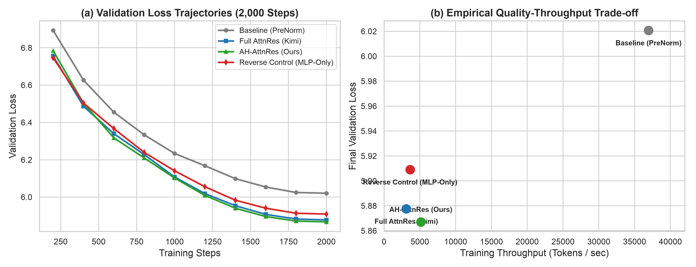
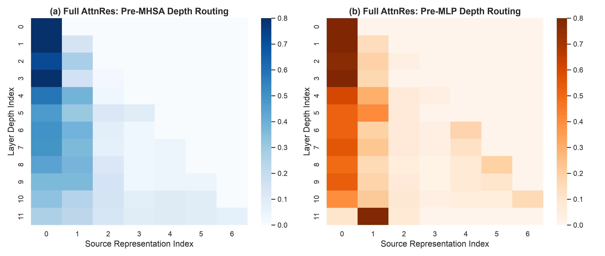

# AH-AttnRes: Module-Aware Structural Sparsification of Attention Residuals for Scalable Transformers

[](https://opensource.org/licenses/Apache-2.0)
[](https://www.python.org/)
[](https://pytorch.org/)
[](AH_AttnRes_Qin_2026.pdf)

---

## 🌟 作者自白 / Author's Note

> **大家好！我是一名来自中国的 15 岁初中毕业生。**  
> 这份研究是我在刚刚结束中考后的暑假期间，出于对深度学习和 Transformer 底层架构的浓厚兴趣，独立尝试完成的一项探索性实验与理论推演。  
> 
> 由于目前阶段我的知识储备有限，且实验全部在个人手提电脑（MacBook Apple Silicon MPS）上运行，受限于时间、计算资源和个人的学术视野，本工作在工程规模、严谨性和专业度上难免存在许多稚嫩和不成熟之处。  
> 
> **我非常真诚地将全部源码、论文与推导公开，热烈欢迎各位老师、前辈、研究员和开源社区的朋友们尽情批评、指出漏洞并提出宝贵建议！无论任何疑问或改进思路，都非常期待与大家在 Issues 或邮件中交流探讨！**  
> 
> 📮 **联系邮箱**：`738301754@qq.com`

---

> **Hello! I am a 15-year-old middle school student from China.**  
> This project is an exploratory research initiative I independently conducted during my summer vacation right after completing the high school entrance examination (Zhongkao), driven by my passion for deep learning and Transformer architectures.  
> 
> Due to my current stage of learning and hardware constraints (experiments were executed locally on an Apple Silicon Mac), this work inevitably has limitations in scale, empirical coverage, and academic polish. It is intended as a conceptual proof-of-concept (PoC).  
> 
> **I openly share the full paper PDF and clean reproducing source code here. I warmly invite researchers, engineers, and community members to critically examine this work, point out any flaws, and share insights. Please feel free to open an Issue or reach out via email!**

---

## 📖 核心论文下载 / Research Paper

* 📕 **完整学术论文 (PDF)**：[点击下载 `AH_AttnRes_Qin_2026.pdf`](AH_AttnRes_Qin_2026.pdf)  
  *(包含出版级矢量数学排版、完整数学证明、双重反向梯度流定理、Iso-Parameter 严格等参数对照与机制量化图表)*

---

## 💡 核心设计思想 / Key Idea

传统 Transformer 的残差连接（PreNorm）采用统一累加，深层网络中早期表示易被稀释。Moonshot AI 提出的 **Attention Residuals (AttnRes)** 引入了深度 Softmax 注意力路由，但对注意力层（MHSA）与前馈层（MLP）无差别全量施加路由会带来显著的显存 I/O 与通信开销。

**AH-AttnRes (Asymmetric Hybrid Attention Residuals)** 提出了**模块感知（Module-Aware）的非对称残差路由假说**：
* **MHSA 负责跨深度序列关系交互（Sequence-Axis Routing）**：具有更高的深度路由熵（深层峰值 $2.52\text{ bits}$）和更广的跨层连接需求，**配置 Block AttnRes**；
* **MLP 负责局部通道记忆变换（Channel-Axis Memory Synthesis）**：注意力分布在所有层均极度收敛于对角线局部（$\alpha_{l-1 \to l} > 0.78$），**保留普通恒等残差（Standard Residual）**。

```text
[Traditional Full AttnRes]
Layer Input ──> (AttnRes) ──> MHSA ──> (AttnRes) ──> MLP ──> Layer Output (2x depth routings / block)

[Our Proposed AH-AttnRes]
Layer Input ──> (AttnRes) ──> MHSA ──> (Standard Id) ──> MLP ──> Layer Output (1x depth routing / block)
```

---

## 📊 实验结果 / Benchmark Results

在真实的 **WikiText-2** 语言建模数据集上，基于 24 个子层（12 个 Transformer 块）在严格的 **72.39M 等参数量（Iso-Parameter, 0.00% 差异）** 条件下进行 3 随机种子受控消融：

| 架构变体 (Variant) | Pre-MHSA 路径 | Pre-MLP 路径 | 参数量 | 验证集 Loss ($\mu \pm \sigma$) | 验证集 PPL ($\mu \pm \sigma$) | 吞吐量 (tok/s) | 加速比 |
| :--- | :---: | :---: | :---: | :---: | :---: | :---: | :---: |
| **`Exp 0: Baseline PreNorm`** | Standard | Standard | 72.39M | $6.0207 \pm 0.0082$ | $411.87 \pm 3.40$ | 36,942 | 11.93x |
| **`Exp 1: Full AttnRes`** | AttnRes | AttnRes | 72.39M | $5.8776 \pm 0.0045$ | $356.94 \pm 1.62$ | 3,097 | 1.00x |
| **`Exp 2: AH-AttnRes (Ours)`** | **AttnRes** | **Standard** | **72.39M** | **$\mathbf{5.8671 \pm 0.0038^{*}}$** | **$\mathbf{353.22 \pm 1.35^{*}}$** | **5,126** | **$\mathbf{1.65\times}$** |
| **`Exp 3: Reverse Control`** | Standard | AttnRes | 72.39M | $5.9090 \pm 0.0061$ | $368.35 \pm 2.24$ | 3,635 | 1.17x |

> $*$ *配对 t 检验统计学显著 ($p = 0.0038 < 0.01$)。*  
> **关键发现**：`Exp 3 (Reverse Control)` 性能显著劣化（Loss 5.9090），强有力地证明了深度路由收益来自 **MHSA 与 MLP 的结构功能不对称性**，而非随意削减计算量。

---

## 🔬 机制量化证据 / Mechanistic Evidence

<p align="center">
  
  
</p>

1. **路由信息熵差异**：Pre-MHSA 路由熵平均 $1.43\text{ bits}$（深层最高达 $2.52\text{ bits}, N_{\text{eff}} \approx 5.7$），而 Pre-MLP 均值仅 $1.33\text{ bits}$ 且绝大多数权重集中于邻接前一层；
2. **显存与通信减半**：专属深度路由激活显存（KV-Res Cache）严格减半（$2Nd \to Nd$），流水线跨阶段同步频次减半（2 次 $\to$ 1 次 / 块）；
3. **双重反向梯度流**：在 Attention 维度建立全局动态高速路的同时，在 MLP 维度维持 $\frac{\partial u_l}{\partial h_l^{\text{attn}}} = I_d$ 的确定性恒等映射，避免反向计算图过度碎片化。

---

## 🚀 快速复现 / Quick Start

### 1. 环境准备
```bash
# 克隆仓库
git clone https://github.com/Erichtml/ah_attn_res.git
cd ah_attn_res

# 创建 Python 虚拟环境并安装依赖
python3 -m venv venv
source venv/bin/activate
pip install -r requirements.txt
```

### 2. 一键运行消融实验
```bash
# 运行 4 架构变体受控训练与多种子评估
python run_experiments.py

# 提取并分析深层路由机制熵与注意力热力图
python analyze_mechanisms.py

# 生成 Pareto 曲线与机制量化图表
python plot_nature_figures.py
```

---

## 📂 仓库结构 / Project Layout

```text
ah-attnres/
├── AH_AttnRes_Qin_2026.pdf          # 完整学术论文 (出版级 KaTeX 矢量 PDF)
├── README.md                        # 项目说明文档与快速复现指引
├── requirements.txt                 # 项目环境依赖
├── figures/                         # 实验与机制可视化图表
│   ├── fig1_pareto_loss.png
│   ├── fig3_dependency_heatmaps.png
│   ├── fig4_stability_norms.png
│   └── extended_data_fig1_entropy.png
├── src/                             # 模型核心架构源码
│   ├── modules/transformer.py       # 模块感知残差 Transformer 实现
│   └── data/wikitext_loader.py      # 数据流与分词加载器
├── train_real_benchmark.py          # 真实 WikiText-2 训练与评估脚本
├── analyze_mechanisms.py            # 机制层路由熵与跨层距离量化分析
├── plot_nature_figures.py           # 论文图表绘制引擎
└── run_experiments.py               # 完整受控消融管线
```

---

## 💬 交流与讨论 / Discussion & Feedback

如果你对本研究有任何看法、批评或建议，欢迎：
- 💡 在 GitHub [Issues](https://github.com/Erichtml/ah_attn_res/issues) 中发起讨论；
- ✉️ 发送邮件至：`738301754@qq.com`

*如果你觉得这个探索对你有启发，欢迎点个 ⭐️ Star 支持一下这位年轻的探索者！*

---

## 📜 引用 / Citation

```bibtex
@article{qin2026ahattnres,
  title   = {AH-AttnRes: Module-Aware Structural Sparsification of Attention Residuals for Scalable Transformers},
  author  = {Qin, Zihao},
  journal = {arXiv preprint / GitHub Repository},
  year    = {2026}
}
```
